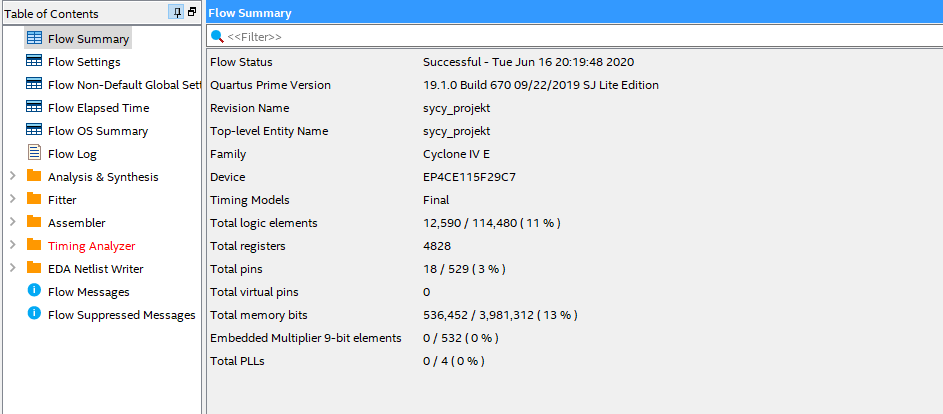

## Finalna wersja projektu z przedmiotu SYCY  

Zdecydowaliśmy się na stworzenie SoPCu obsługującego nasza customową instrukcję (zmodyfikowaną wersję wcześniejszego projektu) aby zakcelerować znajdowanie klucza do zaszyfrowanego dokumentu przy pomocy układu cyfrowego.  

Ponieważ dla takich instrukcji wielkość danych wejściowych i wyjściowych jest jasno określona i za mała dla wcześniejszej wersji wprowadziliśmy pewne zmiany. Instrukcja zwraca do komputera aktualny stan rejestru skonkatenowany z wartością mode określającą wielkość liter, uzupełniony jedneym zerem.
Zamianą tych danych na znaki hasła zajmują się odpowiednie metody napisane w jęzuku C, które są zaimplementowane w projekcie Eclipse.  

Jak widać na poniższych zrzutach ekranu dodaliśmy instrukcję, z sukcesem skompilowaliśmy SoPC i zbudowaliśmy projekt w Eclipse.  

